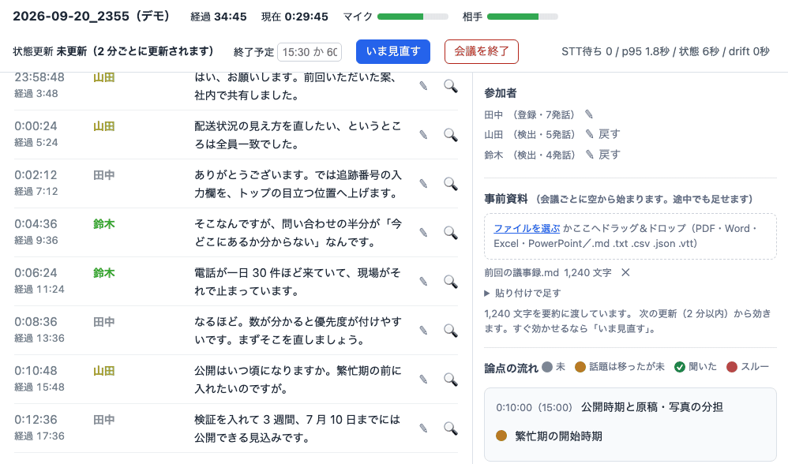
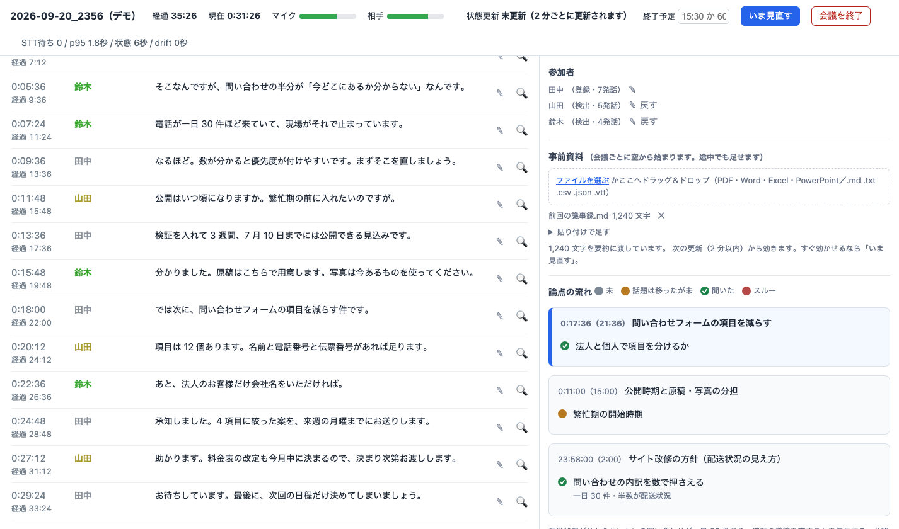
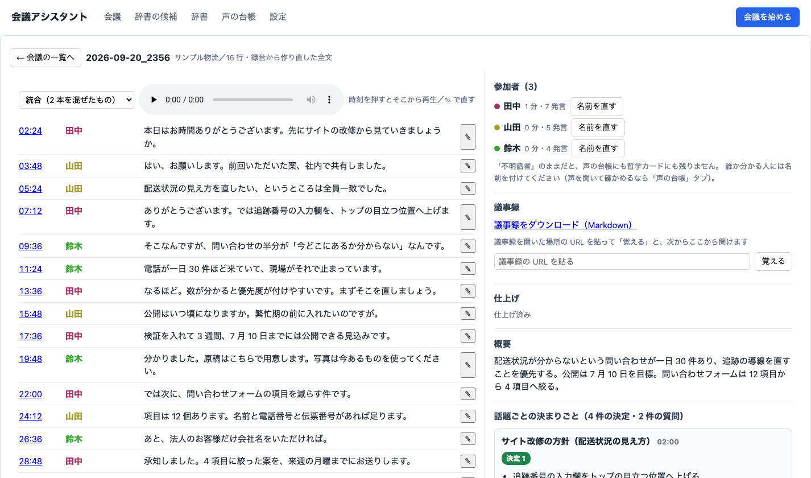
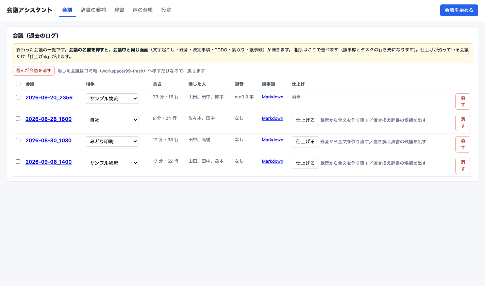

# Meeting Copilot — オンライン会議を、その場で読める形にする

Zoom / Google Meet / Teams などの**オンライン会議を録音し、話している最中に文字起こし・話者の
割り当て・要約を出す**道具です。会議が終わると、話者つき全文・決定事項・TODO が
そのまま出てきて、**議事録（`minutes.md`）まで作ります**。

**すべて手元（あなたの Mac）で完結させることもできますし、精度と速さが要るところだけ
外のモデルに出すこともできます。どちらを使うかは会議ごとに画面で選べます。**

> **はじめに読んでください — これは完成した製品ではありません。**
> 自社の会議のために作って動かしているものを、そのまま公開しています。
> **改造して、自分の使い方に合う形にすることを前提**にしたコードです。
> 導入・設定・不具合について、**無料のサポート窓口はありません**（[サポートについて](#サポートについて)）。
> 導入と利用は**すべて自己責任**でお願いします。



会議中の画面です。左に話者つきの字幕が増えていき、右の「論点の流れ・決定事項・TODO・
未解決の質問」が 2 分ごとに書き換わります。
（画面の中身は説明のための**架空の会議**です。動いているのは製品そのものの画面です）

---

## 何ができるか

| | |
|---|---|
| **会議中の字幕** | 誰が何を言ったかが、話している最中に画面へ出る（手元なら数秒〜10 秒、外の Deepgram なら約 9.5 秒） |
| **話者の割り当て** | 声紋（resemblyzer）で自動。画面の行から名前を付けると、**過去の行にも遡って反映** |
| **前にも出た人** | （使うと決めた場合）前の会議で名前を付けた人を、次の会議の「不明話者」に**「〇〇さん？」と候補で出す**。押せば名前が付く |
| **ローリング要約** | 2 分ごとに「論点・決定事項・TODO・未解決の質問」を更新（30 秒〜3 分で変えられる） |
| **事前資料** | PDF・Word・Excel・PowerPoint を画面へドラッグすると、会議の文脈として使われる |
| **裏取り** | 気になった行の 🔍 を押すと、Web を検索して**出典 URL つき**で「一致／要確認／不明」を返す（Claude CLI か Gemini＋Google 検索） |
| **画面共有** | （使うと決めた場合）相手が共有しているウィンドウを、変わったときだけ控える。**URL とページ名**を手元で読み取り、会議の詳細でその時刻の発言の隣に出す |
| **会議のあと** | 録音から全文を作り直し、**議事録（`minutes.md`）まで作る**。作る手段が無い環境でも、AI チャットに貼るだけの指示書を置く |
| **動かし方を選ぶ** | 機密優先／コスト優先／バランス／速さ優先。処理ごとに「手元か外か」がまとめて決まる。**その Mac でできない選び方は出さない** |
| **あとから直す** | 終わった会議を開いて、時刻から録音を聞き直し、文字と話者を直せる。「不明話者」に名前を付けると声も覚える |



会議が終わると、同じ画面を**あとから開いて読み直せます**。話題ごとに決定事項と TODO が
まとまり、行をクリックすればその時刻から録音を聞けます。



過去の会議・辞書・声の台帳は「会議アシスタント」から扱います。会議を始めるのもここからです。



## 動く環境

- **macOS 専用**です。相手の声の取り込みに ScreenCaptureKit（macOS 12.3+）を使います
- **Apple Silicon 推奨**。手元で文字起こしする場合（既定）は mlx-whisper を使うため
- **Windows / Linux では動きません**（録音の口を差し替える必要があります）
- Python 3.13 以上、ffmpeg

## 手元だけで使う / 外へ出す

この道具は、会議の**音声とテキストがどこへ行くか**を最初から設計に入れています。

| 処理 | 手元で回す（既定） | 外で回す |
|---|---|---|
| 文字起こし | mlx-whisper（無料・オフライン可） | Deepgram（8 秒ごとに音声を送る・画面まで約 9.5 秒）／Gemini（30 秒ごと・約 43 秒） |
| 要約 | Ollama（無料・オフライン可） | Gemini（テキストだけ送る） |
| 議事録 | Ollama（無料・オフライン可） | Claude CLI（サブスク内）／Gemini（テキストだけ） |
| 裏取り | — | Claude CLI（サブスク内）／Gemini＋Google 検索（テキストだけ） |

**画面の「動かし方」で、この 4 つをまとめて決められます**（機密優先／コスト優先／バランス／速さ優先）。
開発元の実測では、月 15 時間の会議で **¥0（全部手元）〜 月 ¥900 ほど（文字起こしも要約も外）**。
手元で回すほど費用は下がりますが、その分だけ**自分の Mac の GPU を使います**
（実測では会議中の文字起こしが 1〜2 分遅れました）。

**外へ出す設定にしていても、会議のたびに画面で「外へ出す／手元で作る」を聞きます。**
答えないまま 120 秒たてば手元に倒れます。断っても会議は普通に回ります（画面に出るのが遅くなるだけ）。

**無料枠では使えません。** Gemini API の無料枠は送った内容が製品改善に使われ、人間のレビュアーが
読むことがあります（規約に明記）。この道具は**課金が有効なプロジェクトであることを機械的に確かめてから**
でないと音声を 1 バイトも送りません。確かめられないときも送りません。

**Deepgram にも同じ考え方の関門を置いています。** 送る要求には毎回「モデル改善に使わない」印
（`mip_opt_out`）を付け、**その形の要求を実際に受け付けるかを 0.3 秒の無音で試してから**でないと
会議の音声を送りません。この印が付いた要求は、応答を返したあと Deepgram 側に**保存もされません**。
印は設定で外せないようにしてあります。詳しくは [SECURITY.md](SECURITY.md)。

## Claude のサブスクが無くても使えるか（手元に何があるかで、できることが変わります）

**文字起こし・話者・会議中の要約は、サブスクに関係なく動きます。** 変わるのは会議のあとの**議事録**と
画面の**裏取り（🔍）**だけです。どちらも、使える手段を上から自動で選び、駄目なら次へ落ちます。

| 手元にあるもの | 会議中の字幕・要約 | 議事録（会議のあと） | 裏取り（🔍） |
|---|---|---|---|
| **何も無い**（Mac だけ） | 字幕は手元の Whisper。要約は出ない | `minutes_prompt.md` を**好きな AI チャットに貼る** | 使えない（押すと理由が出る） |
| **Ollama** | 字幕・要約とも手元 | 手元の LLM で作る（長い会議は分けて要点を取り、最後にまとめる） | 使えない |
| **Deepgram の API キー** | 文字起こしを外で回せる（会議ごとに承認・画面まで約 9.5 秒） | （変わらない） | （変わらない） |
| **Gemini の API キー**（有料枠） | 外で回せる（会議ごとに承認） | Gemini で作る（**その会議で承認したときだけ**） | Gemini＋Google 検索（同上）。検索しないことが多く、そのときは「記憶で答えた」と出る |
| **Claude のサブスク**（`claude` コマンド） | （影響なし） | **Claude CLI で作る**（従量なし・いちばん先に選ぶ） | **Claude CLI が検索してページを開く** |

- 選ぶ順番: 議事録は **Claude CLI → Gemini → Ollama → 貼り付け用の指示書**、裏取りは **Claude CLI → Gemini → なし**
- **Gemini は、会議の始めに「外へ出す」を選んだ会議でだけ**使います。API キーがあるだけでは、議事録や
  裏取りのために会議の中身を黙って外へ出しません
- **最後の逃げ道は必ず残ります。** どれも無くても `minutes_prompt.md`（指示書＋全文）ができるので、
  ChatGPT・Claude・Gemini の画面に貼れば議事録になります（その場合、貼った先の規約に従います）
- 手段を固定したいときは `minutes.engine` と `meeting.verify_engine` で選べます（[SETUP.md](SETUP.md) 6-1）
- **どの鍵を、どこで取って、どこに置くか**は [SETUP.md の 7 章（鍵の早見表）](SETUP.md)にまとめてあります。
  手元だけで使うなら、鍵はひとつも要りません

## 自分の道具につなぐ

出来たものは `workspace/sessions/<会議>/` に残るだけで、**どこにも送りません**。
議事録を Notion へ、TODO をタスク管理へ、終わったことをチャットへ——という使い方は、
作った側（自社）では同じコードでやっています。その**つなぎ口は残してあり**、
相手先だけを空にしてあります。差し替え方は [SETUP.md の 10 章](SETUP.md)に書きました。

## しくみを知りたい

[ARCHITECTURE.md](ARCHITECTURE.md) に、**何を使い・どう流し・なぜそう決めたか**を実測つきで
書いてあります（音声の取り込み／VAD の切り方／声紋での話者割り当て／30 秒バッチの作り方と
無音の落とし方／要約の差分更新／手元とクラウドの比較表／精度の測り方）。

## はじめかた

[SETUP.md](SETUP.md) に、まっさらな Mac からの手順を書いてあります。**最初は手元だけ（無料）で
動かせます**。慣れてから外へ出すかを決めてください。

```bash
git clone <このリポジトリ>
cd meeting-copilot
python3 -m venv .venv && source .venv/bin/activate
pip install -r requirements.txt
cp config/settings.example.yaml config/settings.yaml   # 名前とマイクを自分のものに
python -m src.main --mode meeting_loopback
```

ターミナルを開かずに使いたいときは、`scripts/アプリを作る.command` をダブルクリックすると
`/Applications/会議アシスタント.app` ができます。メニューバーの 🎙 から会議を始められ、
記録している間は 🔴 に変わります（署名していない `.app` を配ると Gatekeeper に隔離されるので、
**手元で作る**形にしています）。

## 出てくるもの

```
workspace/sessions/<会議>/
├── minutes.md                # 議事録（作る手段があったとき）
├── minutes_prompt.md         # 作る手段が無かったとき: AI チャットに貼る指示書＋全文
├── minutes_input.md          # 議事録の材料（話者つき全文・決定事項・TODO）
├── glossary_candidates.json  # 置き換え辞書の候補（画面「会議アシスタント」で選ぶ）
├── interview_summary.md      # 会議ダッシュボード
├── transcripts.jsonl         # 会議中の全文
├── transcripts_final.jsonl   # 録音から作り直した全文
├── recording_self.wav        # 自分のマイク
├── recording_remote.wav      # 相手側（システム音声）
├── speakers.json             # 声紋（この会議の分）
├── screens/                  # 画面共有のキャプチャ（使うと決めた場合）
├── screens.jsonl             # その時刻・URL・ページ名
├── meeting_key.json          # どの会議だったかの手がかり（Meet のコード・Zoom の ID）
├── voice_matches.jsonl       # 声の候補を押した／断ったの記録（声の台帳を使うとき）
└── verifications.jsonl       # 裏取りの記録（発言・判定・出典）
```

## 限界

- **話者の割り当ては完璧ではありません。** 実際の会議（50 分・3 人）で 96〜97% でした。
  会議の冒頭は声紋が育っていないので弱く、画面から名前を付けると以後と過去に効きます
- **文字起こしも完璧ではありません。** 手元の Whisper は物音を言葉にすることがあります
  （その対策として自信の低い出力を落としていますが、ゼロにはなりません）。
  **エンジンを変えても精度はほとんど変わりません**（開発元の実測・文字の食い違い率:
  朗読 Whisper 13.0% / Gemini 13.3% / Deepgram 13.3%、会話 Deepgram 38.2% / Gemini 39.2% /
  Whisper 43.0%）。変わるのは**速さと費用**です。自分の音源で測る道具も入れてあります
  （`scripts/bench_asr.py`）
- **要約は「会議中の下書き」です。** 議事録は会議のあとに作り直したものを使ってください
- 相手の声はシステム音声から拾うので、**イヤホンで聞いている必要はありません**が、
  スピーカーで聞くと自分のマイクにも回り込み、同じ発言が二重に文字起こしされます

## サポートについて

この道具は、自社の会議のために作って使っているものを、そのまま公開したものです。
**完成した製品ではなく、誰にでもそのまま動く形に整えたものでもありません。**
自分の環境に合わせて**自由に改造して使っていただくこと**を前提にしています。

- **無料のサポート窓口はありません。** 設定が難しい・動かない・エラーが出る、といったご連絡に
  個別にお答えすることはしていません。Issue や問い合わせへの返答も、お約束できません
- **導入・設定・運用は、すべて利用者ご自身の責任**で行ってください
- **この道具を使ったことで生じたいかなる損害・不利益についても、当方は一切の責任を負いません**
  （会議の録音・文字起こしの欠落や誤り、外部サービスへの送信とその費用、機密情報の取り扱いを含みます）
- 動かすかどうかの判断材料は、[SETUP.md](SETUP.md)・[SECURITY.md](SECURITY.md)・
  [ARCHITECTURE.md](ARCHITECTURE.md) に書けるだけ書いてあります。まずそちらをお読みください

### 有償での対応

導入の支援・自社向けの改造・運用の相談は、**有償で個別にお受けしています**。
対応の範囲・工数・条件によって費用は変わりますので、必要な方はご相談ください。

<table>
  <tr>
    <td width="210" align="center" valign="middle">
      <a href="https://lofir.net/">
        <picture>
          <source media="(prefers-color-scheme: dark)" srcset="docs/images/corp-logo-dark.png">
          
        </picture>
      </a>
    </td>
    <td valign="middle">
      <strong><a href="https://lofir.net/">LOFIR.inc</a></strong><br>
      この道具を作って、<strong>自分たちの会議で毎日使っている会社</strong>です。<br>
      WordPress サイト制作・AI 導入・マーケティングの伴走支援をしています。<br>
      導入の支援・改造・運用のご相談 → <a href="https://lofir.net/contact/">お問い合わせフォーム</a>
    </td>
  </tr>
</table>

## ライセンス

MIT License（[LICENSE](LICENSE)）。

本ソフトウェアは「現状のまま」提供され、明示・黙示を問わずいかなる保証もありません。
詳しくは [LICENSE](LICENSE) をご確認ください。
